# Java Decoded

Personal notes for studying the Java Programming Language based on some some books like Big Java Early Objects, by Cay Horstmann.

## Javadoc Commenting
    Provide documentation comments for 
    every class, every method, 
    every parameter variable, and every return value.
You can invoke the _javadoc_ utility from a shell window, by issuing the command:
`javadoc MyClass.java`
or, if you want to document multiple Java files,
`javadoc *.java`

**The javadoc utility copies the first sentence of each comment to a summary table in the HTML documentation**.
Therefore, it is best to write that first sentence with some care. 
It should start with an uppercase letter and end with a period.
```java
Starts with /** and Ends with */

/** 
Withdraws money from the bank account.
@param amount the amount to withdraw
*/
public void withdraw(double amount)
{
implementation—filled in later
}
/**
Gets the current balance of the bank account.
@return the current balance
*/
public double getBalance()
{
implementation—filled in later
}

```

## Unit Testing

    To test a class, use an environment for interactive testing, 
    or write a tester class to execute test instructions.

Alternatively, you can write a tester class. A tester class is a class with a main method that contains statements to run methods of another class. As discussed in Section 2.7, a tester class typically carries out the following steps:
1. Construct one or more objects of the class that is being tested.
2. Invoke one or more methods.
3. Print out one or more results.
4. Print the expected results.


## Primitive Types

    Java has eight primitive types, including four integer types
    and two floatingpoint types.

* Notes: The largest number that can be represented in an int is denoted by _Integer.MAX_VALUE_. Its value is about 2.14 billion. Similarly, the smallest integer is _Integer.MIN_VALUE_, about –2.14 billion.

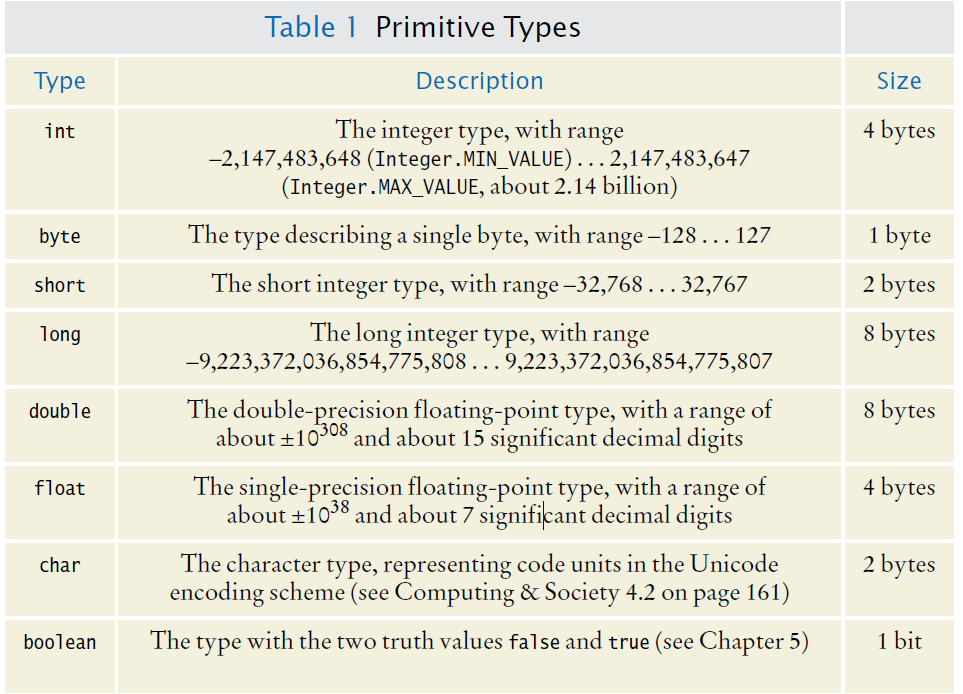

## Keyword _final_
A _final_ variable is a constant. Once its value has been set, it cannot be changed. Many programmers use all-uppercase names for constants (final variables), such as NICKEL_VALUE.

Frequently, constant values are needed in several methods. Then you should declare them together with the instance variables of a class and tag them as _static_ and _final_.
As before, _final_ indicates that the value is a constant. The _static_ reserved word means that the constant belongs to the class — this is explained in greater detail in Chapter 8.): 

```java
public class CashRegister
    {
        // Constants
        public static final double QUARTER_VALUE = 0.25;
        public static final double DIME_VALUE = 0.1;
        public static final double NICKEL_VALUE = 0.05;
        public static final double PENNY_VALUE = 0.01;
        
        // Instance variables
        private double purchase;
        private double payment;
        
        // Methods
        . . .
    }  

```

## Big Numbers
If you want to compute with really large numbers, you can use big number objects. Big number objects are objects of the _BigInteger_ and _BigDecimal_ classes in the java.math package. Unlike the number types such as int or double, big number objects have essentially no limits on their size and precision. However, computations with big number objects are much slower than those that involve number types. Perhaps more importantly, you can’t use the familiar arithmetic operators such as (+ - *) with them. Instead, you have to use methods called add, subtract, and multiply. Here is an example of how to create a _BigInteger_ object and how to call the multiply method:

```java
BigInteger n = new BigInteger("1000000");
BigInteger r = n.multiply(n);
System.out.println(r); // Prints 1000000000000
```

The _BigDecimal_ type carries out floating-point computations without roundoff errors. For example,

```java
BigDecimal d = new BigDecimal("4.35");
BigDecimal e = new BigDecimal("100");
BigDecimal f = d.multiply(e);
System.out.println(f); // Prints 435.00
```

## Arithmetics

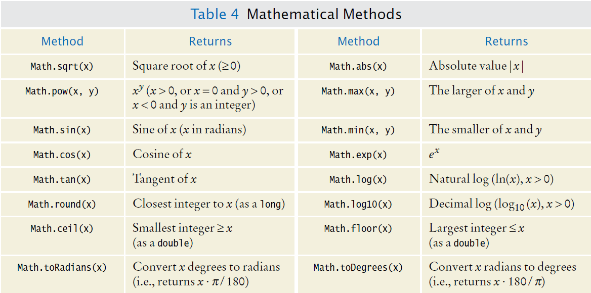

For converting a value to another datatype use a cast _(typename)_:
    `int dollars = (int) (total + tax);`
To round it:
    `long rounded = Math.round(balance);`

## Input an Output

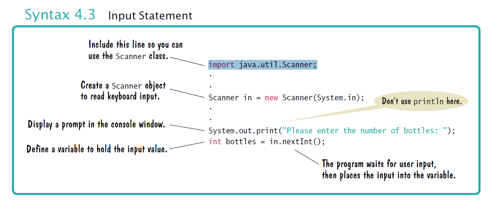

To format output we use:
    `System.out.printf("Quantity: %d Total: %10.2f", quantity, total);`
    The _printf_ method with options:

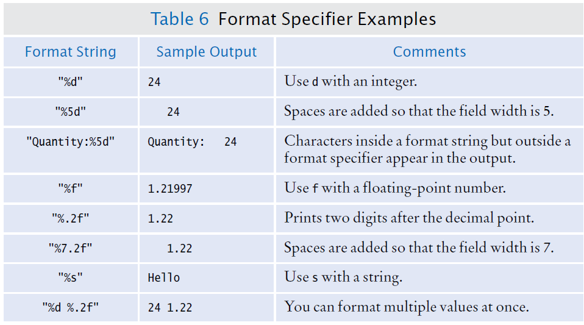

## Decisions

Java has a conditional operator of the form
`condition ? value1 : value2`
The value of that expression is either value1 if the test passes or value2 if it fails. For example,
we can compute the actual floor number as
`actualFloor = floor > 13 ? floor - 1 : floor;`
which is equivalent to
`if (floor > 13) { actualFloor = floor - 1; } else { actualFloor = floor; }`

## Enumeration Types

An enumeration type has a finite set of values, for example
`public enum FilingStatus { SINGLE, MARRIED, MARRIED_FILING_SEPARATELY }`
You can have any number of values, but you must include them all in the enum declaration. You can declare variables of the enumeration type:
`FilingStatus status = FilingStatus.SINGLE;`
If you try to assign a value that isn’t a FilingStatus, such as 2 or "S", then the compiler reports an error.
Use the == operator to compare enumeration values, for example:
`if (status == FilingStatus.SINGLE) . . .`
Place the enum declaration inside the class that implements your program, such as
```java
public class TaxReturn
{
    public enum FilingStatus { SINGLE, MARRIED, MARRIED_FILING_SEPARATELY }
    . . .
}
```

## Printing Logs

Instead of printing directly to System.out, use the global logger object that is returned by the call `Logger.getGlobal()`. Then call the info method:

`Logger.getGlobal().info("status is SINGLE");`

By default, the message is printed. But if you call

`Logger.getGlobal().setLevel(Level.OFF);`

at the beginning of the main method of your program, all log message printing is suppressed.
Set the level to `Level.INFO` to turn logging of info messages on again. 
Thus, you can turn off the log messages when your program works fine, and you can turn them back on if you find another error. In other words, using `Logger.getGlobal().info` is just like `System.out.println`, except that you can easily activate and deactivate the logging.

## Redirect Input and Output
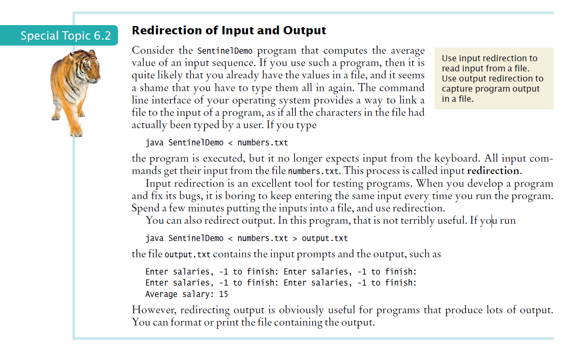

## Generating Random Numbers

| Method | Returns |
| --- | --- |
| nextInt(n) | A random integer between the integers 0 (inclusive) and n (exclusive) |
| nextDouble() | A random floating-point number between 0 (inclusive) and 1 (exclusive) |

```java
Random generator = new Random();
int d = 1 + generator.nextInt(6);
```


## Enhanced For Loop

Use the enhanced for loop if you do not need the index values in the loop body.

```java
for (double element : values)
{
    ...
    element = 0; // ERROR: this assignment does not modify array elements
}
```

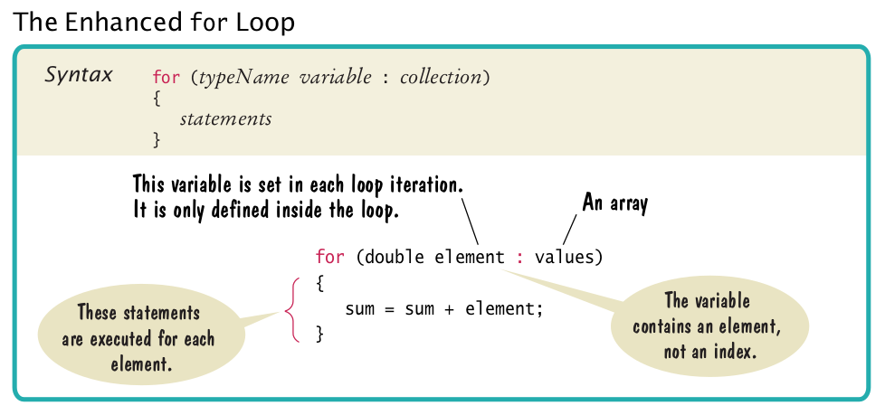

## Arrays as Parameters

It is possible to declare methods that receive a variable number of arguments. For example, we can write a method that can add an arbitrary number of scores to a student:
```java
fred.addScores(10, 7); // This method call has two arguments
fred.addScores(1, 7, 2, 9); // Another call to the same method, now with four arguments
```
The method must be declared as

`public void addScores(int... values)`

The `int...` type indicates that the method can receive any number of int arguments. The values parameter variable is actually an `int[] array` that contains all arguments that were passed to the method

## Array Lists

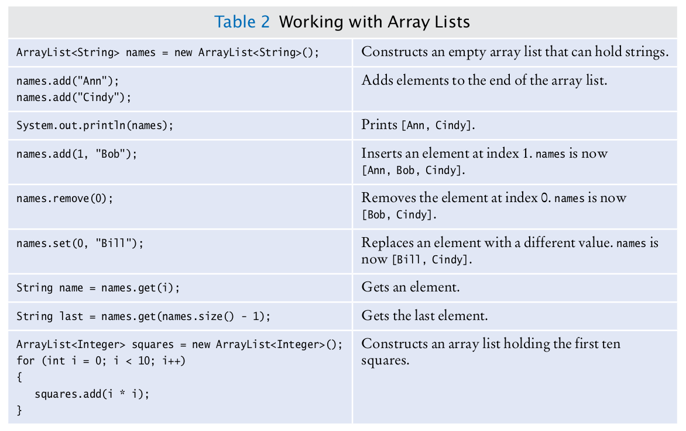

For most programming tasks, array lists are easier to use than arrays. Array lists can grow and shrink. On the other hand, arrays have a nicer syntax for element access and initialization.
Which of the two should you choose? Here are some recommendations.

* If the size of a collection never changes, use an array.
* If you collect a long sequence of primitive type values and you are concerned about efficiency, use an array.
* Otherwise, use an array list.

## Designing Classes

A class should represent a single concept from a problem domain, such as business, science, or mathematics.

Very occasionally, a class has no objects, but it contains a collection of related static methods and constants. The Math class is an example. Such a class is called a utility class. Finally, you have seen classes with only a main method. Their sole purpose is to start a program. From a design perspective, these are somewhat degenerate examples of classes.

The public interface of a class is ***cohesive*** if all of its features are related to the concept that the class represents.

Some classes have been designed to have only accessor methods and no mutator methods at all. Such classes are called **immutable**. An example is the String class. Once a string has been constructed, its content never changes. No method in the String class can modify the contents of a string. For example, the toUpperCase method does not change characters from the original string. Instead, it constructs a new string that contains the uppercase characters.

As a rule of thumb, a method that returns a value should not be a mutator. For example, one would not expect that calling getBalance on a BankAccount object would change the balance. If you follow this rule, then all mutators of your class have return type void.

Sometimes, this rule is bent a bit, and mutator methods return an informational value. For example, the ArrayList class has a remove method to remove an object.
```java
ArrayList<String> names = . . .;
boolean success = names.remove("Romeo");
```
That method returns true if the removal was successful; that is, if the list contained the object. Returning this value might be bad design if there was no other way to check whether an object exists in the list. However, there is such a method––the contains method. **It is acceptable for a mutator to return a value if there is also an accessor that computes it.**
The situation is less happy with the Scanner class. The next method is a mutator that returns a value.  Unfortunately, there is no accessor that returns the same value. This sometimes makes it awkward to use a Scanner. You must carefully hang on to the value that the next method returns because you have no second chance to ask for it. It would have been better  if there was another method, say *peek*, that yields the next input without consuming it.

## Call by Value or by Reference

• A Java method can’t change the contents of any variable passed as an argument.
• A Java method can mutate an object when it receives a reference to it as an argument.

In Java, a method **can never change** the original contents of a **variable** that is passed to a method.

In Java, a method **can change** the state of **an object reference argument**, but it **cannot replace** the object reference with another.

## Object Distinct States

If your object can have one of several states that affect the behavior, supply an instance variable for the current state.

```java
public class Fish
{
    private int hungry;
    public static final int NOT_HUNGRY = 0;
    public static final int SOMEWHAT_HUNGRY = 1;
    public static final int VERY_HUNGRY = 2;
    . . .
}
(Alternatively, you can use an enumeration––see Special Topic 5.4)
```

Determine which methods change the state. In this example, a fish that has just eaten won’t be hungry. But as the fish moves, it will get hungrier:
```java
public void eat()
{
    hungry = NOT_HUNGRY;
    . . .
}
public void move()
{
    . . .
    if (hungry < VERY_HUNGRY) { hungry++; }
}
```
Finally, determine where the state affects behavior. A fish that is very hungry will want to look for food first:
```java
public void move()
{
        if (hungry == VERY_HUNGRY)
        {
        Look for food.
        }
        . . .
}
```

## Static Variables and Methods

A static variable belongs to the class, not to any object of the class.
```java
public class BankAccount
{
    private double balance;
    private int accountNumber;
    private static int lastAssignedNumber = 1000;
    
    public BankAccount()
    {
       lastAssignedNumber++;
       accountNumber = lastAssignedNumber;
    }
    . . .
}
```
Every BankAccount object has its own balance and accountNumber instance variables, but **all objects share a single copy of the lastAssignedNumber variable**. That variable is stored in a separate location, outside any BankAccount objects.

**Like instance variables, static variables should always be declared as private to ensure that methods of other classes do not change their values**. However, static constants may be either private or public.

Sometimes a class defines methods that are not invoked on an object. Such a method is called a **static method**. A typical example of a static method is the *sqrt method in the Math clas*s. Because numbers aren’t objects, you can’t invoke methods on them. For example, if x is a number, then the call x.sqrt() is not legal in Java. Therefore, the Math class provides a static method that is invoked as Math.sqrt(x). No object of the Math class is constructed. The Math qualifier simply tells the compiler where to find the sqrt method.

There is a variant of the import directive that lets you use static methods and variables without class prefixes. For example,
```java
import static java.lang.System.*;
import static java.lang.Math.*;
public class RootTester
{
    public static void main(String[] args)
    {
        double r = sqrt(PI); // Instead of Math.sqrt(Math.PI)
        out.println(r); // Instead of System.out
    }
}
```
Static imports can make programs easier to read, particularly if they use many mathematical functions.

## Packages

A package is a set of related classes.

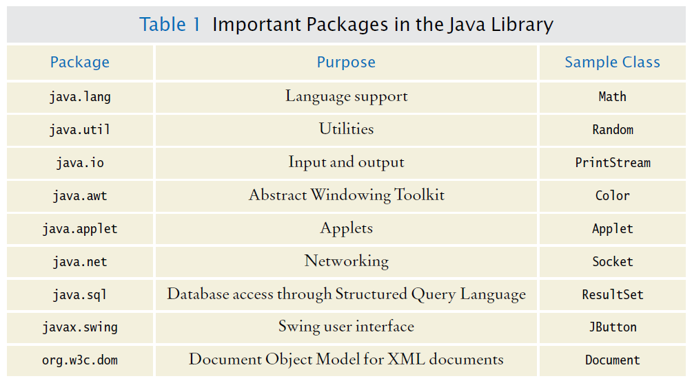

To put one of your classes in a package, you must place a line
`package packageName;`
as the first instruction in the source file containing the class.

In addition to the named packages (such as java.util or com.horstmann.bigjava), there is a special package, called the default package, which has no name. If you did not include any package statement at the top of your source file, its classes are placed in the default package.

The import directive lets you refer to a class of a package by its class name, without the package prefix.

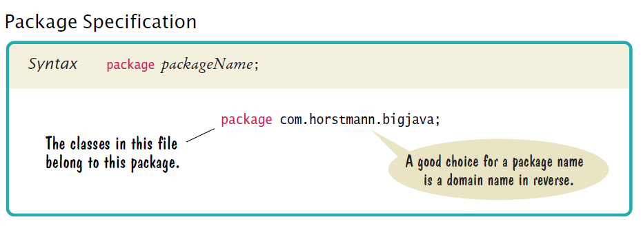

If you don’t have your own domain name, you can still create a package name that has a high probability of being unique by writing your e-mail address backwards. For example, if Britney Walters has an e-mail address `walters@cs.sjsu.edu`, then she can use a package name edu.sjsu.cs.walters for her own classes. 
Some instructors will want you to place each of your assignments into a separate package, such as homework1, homework2, and so on. The reason is again to avoid name collision. You can have two classes, homework1.Bank and homework2.Bank, with slightly different properties.

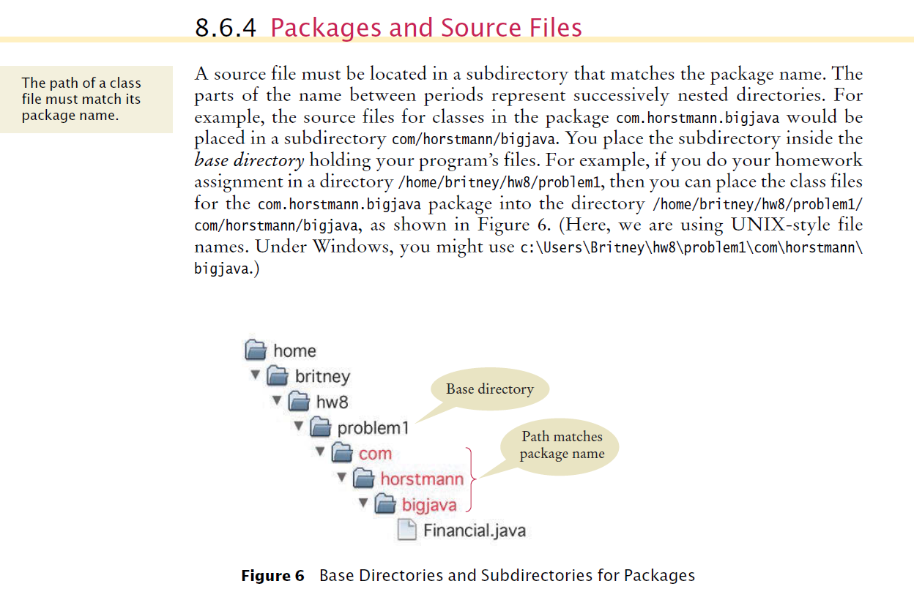

An instance variable or method that is not declared as public or private can be accessed by all classes in the same package, which is usually not desirable.

## Unit Test FrameWorks

**Unit test frameworks simplify the task of writing classes that contain many test cases.**

Unit testing frameworks were designed to quickly execute and evaluate test suites and to make it easy to incrementally add test cases. One of the most popular testing frameworks is JUnit. It is freely available at http://junit.org, and it is also built into a number of development environments, including BlueJ and Eclipse. Here we describe JUnit 4, the most current version of the library as this book is written. When you use JUnit, you design a companion test class for each class that you develop. You provide a method for each test case that you want to have executed. You use “annotations” to mark the test methods.
An annotation is an advanced Java feature that places a marker into the code that is interpreted by another tool. In the case of JUnit, the @Test annotation is used to mark test methods. In each test case, you make some computations and then compute some condition that you believe to be true. You then pass the result to a method that communicates a test result to the framework, **most commonly the assertEquals method. The assertEquals method takes as arguments the expected and actual values and, for floatingpoint numbers, a tolerance value.**

It is also customary (but not required) that the name of the test class ends in Test, such as *CashRegisterTest*.
Here is a typical example:
```java
import org.junit.Test;
import org.junit.Assert;
public class CashRegisterTest
{
    @Test public void twoPurchases()
    {
        CashRegister register = new CashRegister();
        register.recordPurchase(0.75);
        register.recordPurchase(1.50);
        register.receivePayment(2, 0, 5, 0, 0);
        double expected = 0.25;
        Assert.assertEquals(expected, register.giveChange(), EPSILON);
    }
    // More test cases
    . . .
}
```
The JUnit philosophy is to run all tests whenever you change your code.

## Inheritance

*Inheritance is a relationship between a more general class (called the super­class) and a more specialized class (called the subclass).* 
The subclass inherits data and behavior from the superclass.

The **substitution principle** states that you can always use a subclass object when a superclass object is expected. A subclass inherits all methods that it does not override. Subclass objects automatically have the instance variables that are declared in the superclass. You only declare instance variables that are not part of the superclass objects.

The subclass inherits all Media public methods from the superclass. 
You declare any methods that are new to the subclass, and change the implementation of inherited methods if the inherited behavior is not appro­priate. When you supply a new implementation for an inherited method, you override the method.
```java
public class ChoiceQuestion extends Question
{
    // This instance variable is added to the subclass
    private ArrayList<String> choices;
    
    // This method is added to the subclass
    public void addChoice(String choice, boolean correct) { . . . }
    
    // This method overrides a method from the superclass
    public void display() { . . . }
}
```
The reserved word extends denotes inheritance - indicates that a class inherits from a superclass.

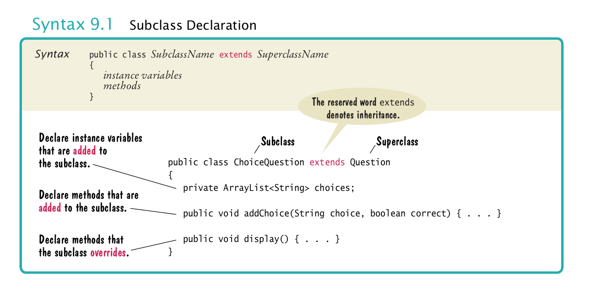

## Override Methods from SuperClass

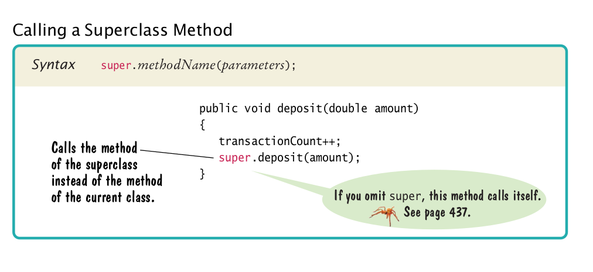

Unless specified otherwise, the subclass constructor calls the superclass constructor with no arguments. To call a superclass constructor, use the super reserved word in the first statement of the subclass constructor.

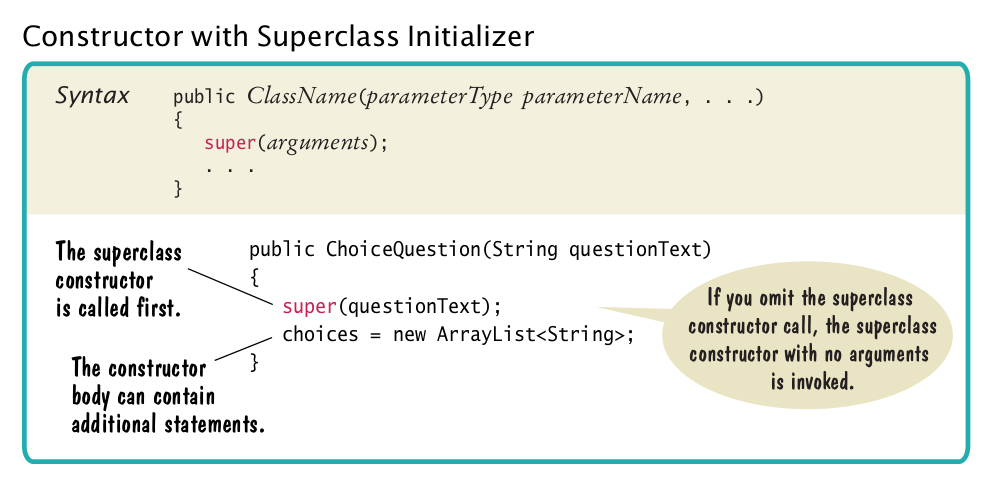

## Polymorphism

When you extend an existing class, you have the choice whether or not to override the methods of the superclass. Sometimes, it is desirable to force programmers to override a method.
That happens when there is no good default for the superclass and only the subclass programmer can know how to implement the method properly.

`public abstract void deductFees();`

An abstract method has no implementation. This forces the implementors of subclasses to specify concrete implementations of this method. (Of course, some subclasses might decide to implement a do-nothing method, but then that is their choice—not a silently inherited default.)
You cannot construct objects of classes with abstract methods. For example, once the Account class has an abstract method, the compiler will flag an attempt to create a new Account() as an error.
A class for which you cannot create objects is called an abstract class. A class for which you can create objects is sometimes called a concrete class. In Java, you must declare all abstract classes with the reserved word abstract :
```java
public abstract class Account
    {
        public abstract void deductFees();
        . . .
        }
        public class SavingsAccount extends Account // Not abstract
        {
        . . .
        public void deductFees() // Provides an implementation
        {
        . . .
    }
} 
```
If a class extends an abstract class without providing an implementation of all abstract methods, it too is abstract.
```java
public abstract class BusinessAccount
{
// No implementation of deductFees
}
```
Note that you cannot construct an object of an abstract class, but you can still have an object reference whose type is an abstract class. Of course, the actual object to which it refers must be an instance of a concrete subclass:
```java
Account anAccount; // OK
anAccount = new Account(); // Error— Account is
anAccount = new SavingsAccount(); // OK
anAccount = null; // OK
```

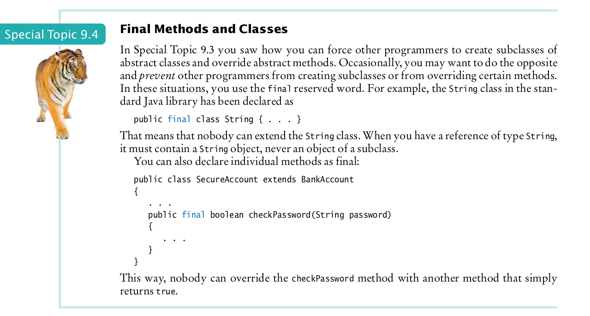

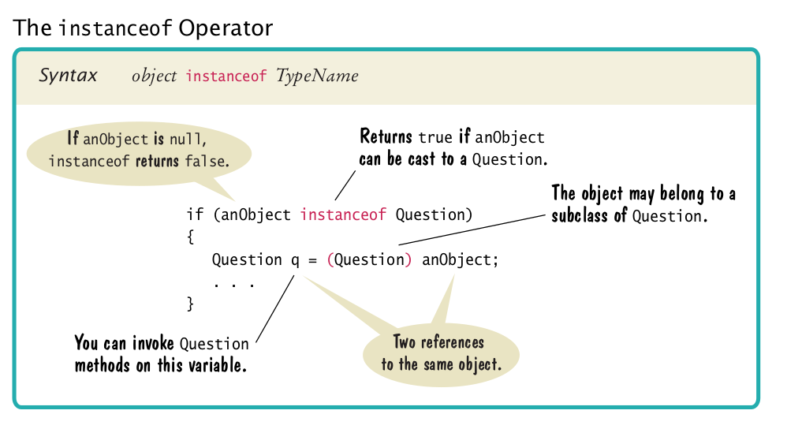

## Interfaces

A Java interface type declares the methods that can be applied to a variable of that type.

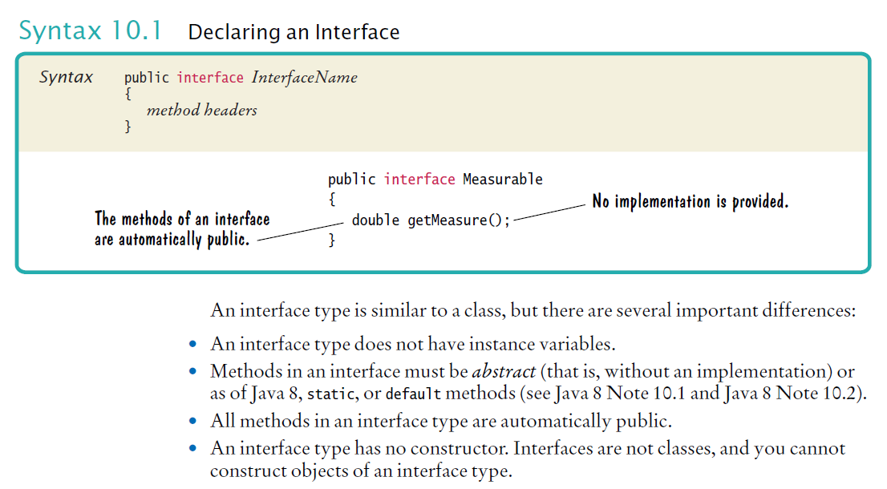

Now that we have a type that denotes measurability, we can implement a reusable *average method*:
```java
public static double average(Measurable[] objects)
{
    double sum = 0;
    for (Measurable obj : objects)
    {
        sum = sum + obj.getMeasure();
    }
    if (objects.length > 0) { return sum / objects.length; }
    else { return 0; }
}
```

Use the **implements** reserved word to indicate that a class implements an interface type.

The **average** method of the preceding section can process objects of any class that implements the **Measurable** interface. A class **implements** an interface type if it
declares the interface in an implements clause, like this:

`public class BankAccount implements Measurable`

The class should then implement the abstract method or methods that the interface requires:
```java
public class BankAccount implements Measurable
{
    . . .
    public double getMeasure()
    {
    return balance;
    }
}
```
Note that the class must declare the method as **public**, whereas the interface need not—all methods in an interface are public.
Once the **BankAccount** class implements the **Measurable** interface type, **BankAccount** objects are instances of the **Measurable** type:

`Measurable obj = new BankAccount(); // OK`

A variable of type **Measurable** holds a reference to an object of some class that implements the **Measurable** interface.

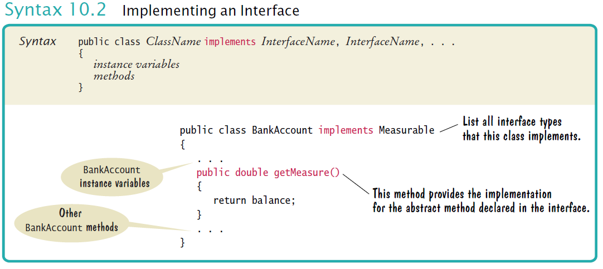

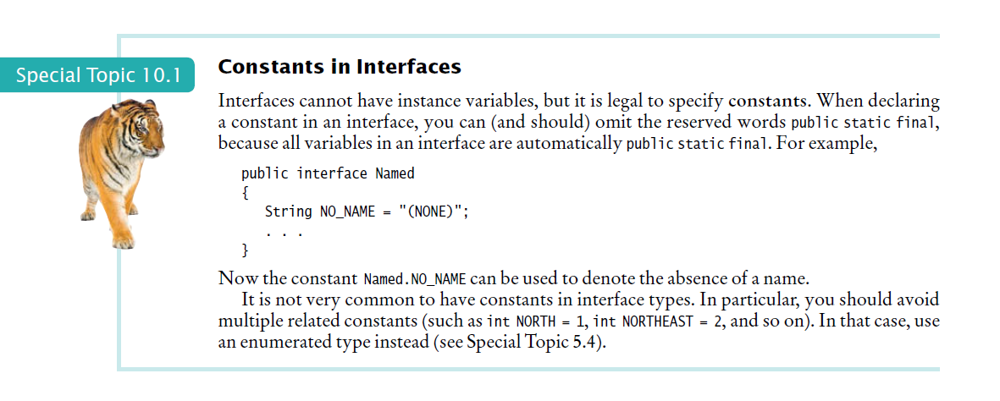

    See 10.3 for the **Comparable Interface** and **clone** method.


## Throw Exceptions

To signal an exceptional condition, use the throw statement to throw an exception object.

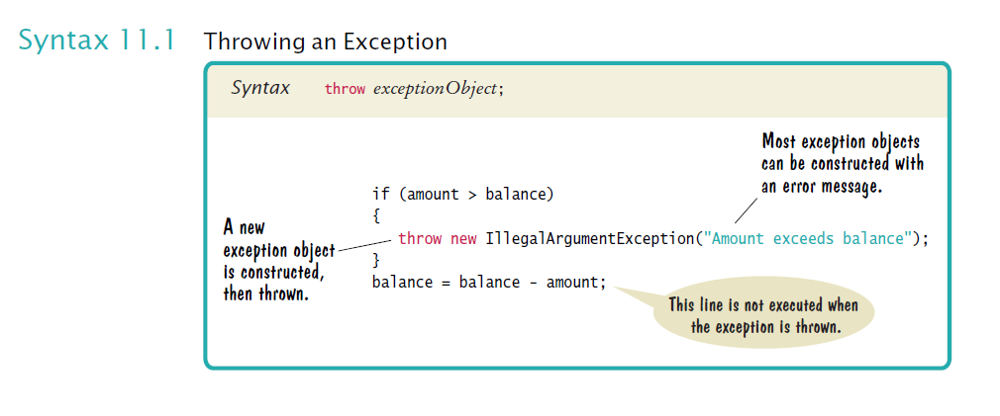

Place the statements that can cause an exception inside a try block, and the handler inside a catch clause.

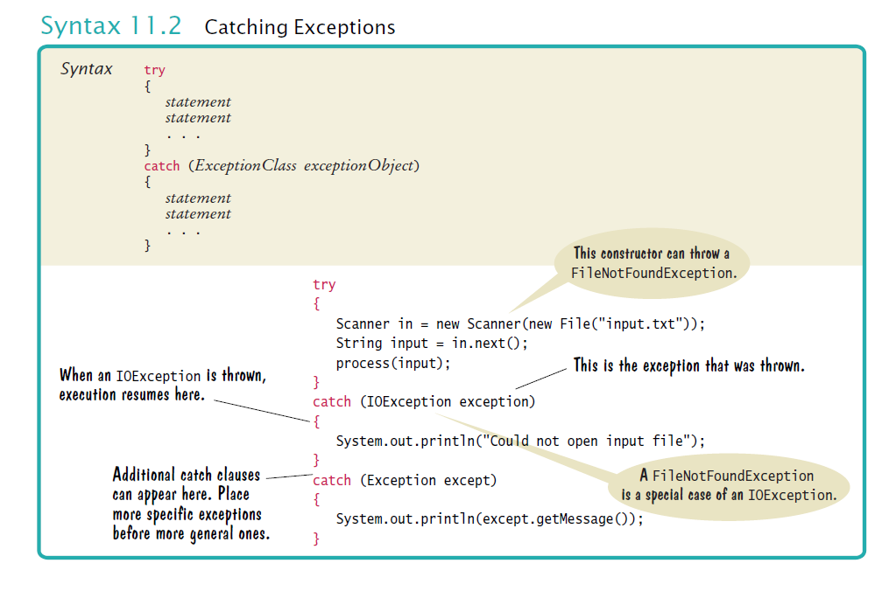

Add a throws clause to a method that can throw a checked exception.

However, it commonly happens that the current method cannot handle the exception.
In that case, you need to tell the compiler that you are aware of this exception and that you want your method to be terminated when it occurs. You supply the method with a throws clause:
```java
public void readData(String filename) throws FileNotFoundException
{
    File inFile = new File(filename);
    Scanner in = new Scanner(inFile);
    . . .
}
```

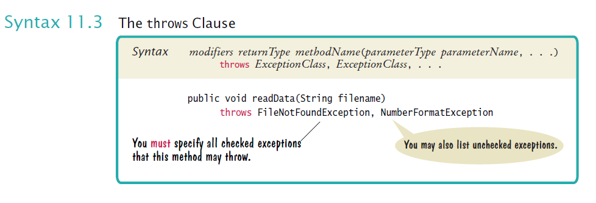

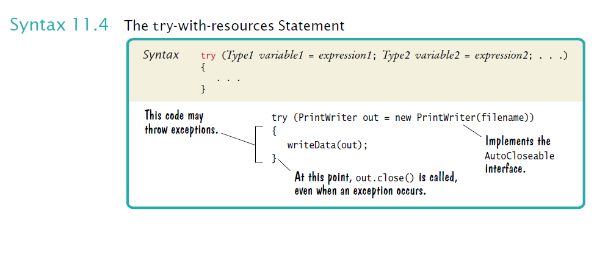

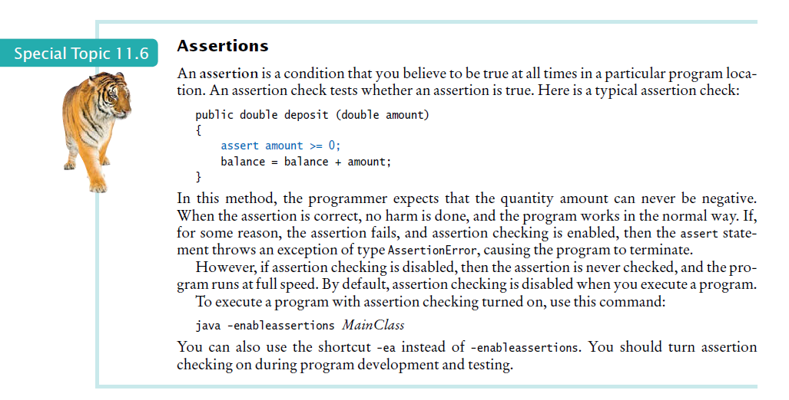

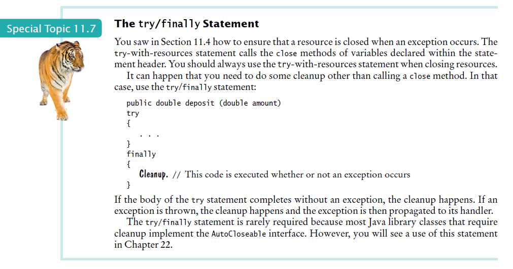


## Collections

A collection groups together elements and allows them to be retrieved later.

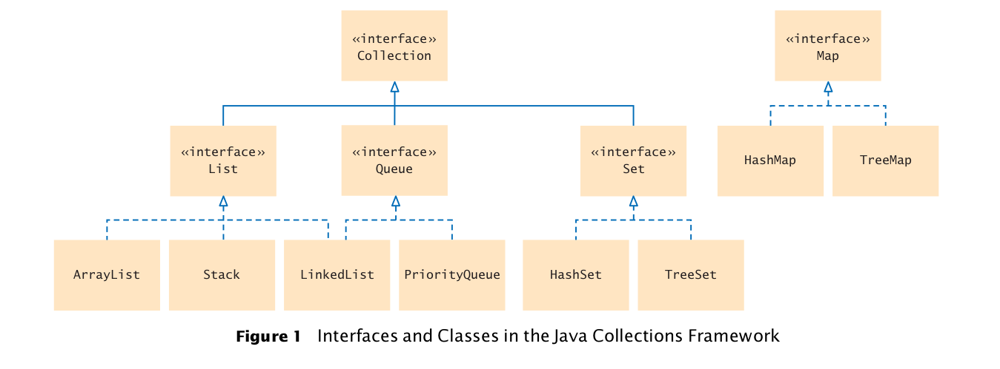

* A **list** is a collection that remembers the order of its elements.
* A **set** is an unordered collection of unique elements.
* A **map** keeps associations between key and value objects.
* A **stack** remembers the order of its elements, but it does not allow you to insert elements in every position. You can add and remove elements only at the top.
* In a **queue**, you add items to one end (the tail) and remove them from the other end (the head). 
* A **priority queue** is an unordered collection that has an efficient operation for removing the element with the highest priority. 

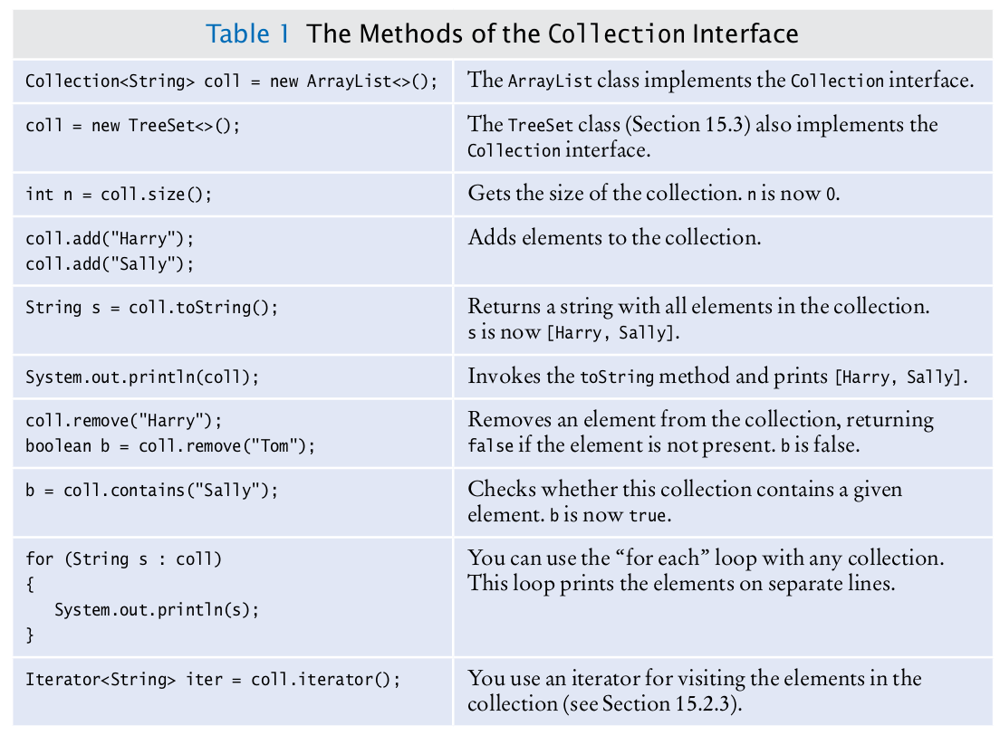

## Linked List

A **linked list** is a data structure used for collecting a sequence of objects that allows efficient addition and removal of elements in the middle of the sequence.
A **linked list** consists of a number of nodes, each of which has a reference to the next node.

* Adding and removing elements at a given location in a linked list is efficient.
* Visiting the elements of a linked list in sequential order is efficient, but random access is not.

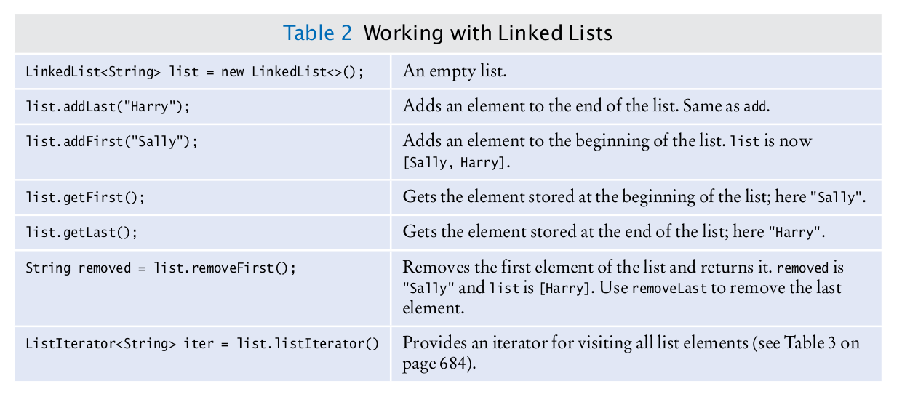

You use a list iterator to access elements inside a linked list.

```java
LinkedList<String> employeeNames = . . .;
ListIterator<String> iterator = employeeNames.listIterator();
```
Note that the iterator class is also a generic type. A `ListIterator<String>` iterates through a list of strings; a `ListIterator<Book>` visits the elements in a `LinkedList<Book>`.
Initially, the iterator points before the first element. You can move the iterator
position with the next method:
`iterator.next();`
The next method throws a NoSuchElementException if you are already past the end of the list. You should always call the iterator’s hasNext method before calling next — it returns true if there is a next element.
```java
if (iterator.hasNext())
{
    iterator.next();
}
```
The next method returns the element that the iterator is passing. When you use a `ListIterator<String>` , the return type of the next method is String . In general, the return type of the next method matches the list iterator’s type parameter (which reflects the type of the elements in the list).
You traverse all elements in a linked list of strings with the following loop:
```java
while (iterator.hasNext())
{
    String name = iterator.next();
    // Do something with name.
}
```
As a shorthand, if your loop simply visits all elements of the linked list, you can use the “for each” loop:
```java
for (String name : employeeNames)
{
    // Do something with name.
}
```

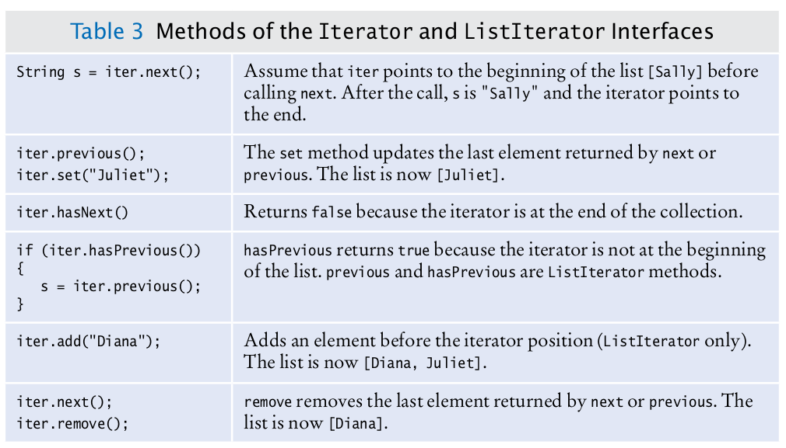

## Set

A **set** organizes its values in an order that is optimized for efficiency, which may not be the order in which you add elements. Inserting and removing elements is more efficient with a set than with a list.

The **HashSet** and **TreeSet** classes both implement the **Set interface**.

These two classes provide set implementations based on two different mechanisms, called **hash tables and binary search trees**. Both implementations arrange the set elements so that finding, adding, and removing elements is efficient, but they use different strategies.
_____
The basic idea of a **hash table** is simple. Set elements are grouped into smaller collections of elements that share the same characteristic. You can imagine a hash set of books as having a group for each color, so that books of the same color are in the same group. To find whether a book is already present, you just need to check it against the books in the same color group. Actually, hash tables don’t use colors, but integer values (called hash codes) that can be computed from the elements. In order to use a hash table, the elements must have a method to compute those integer values. This method is called `hashCode` . The elements must also belong to a class with a properly defined `equals method` (see Section 9.5.2).

Suppose you want to form a set of elements belonging to a class that you declared, such as a `HashSet<Book>` . Then you need to provide hashCode and equals methods for the class `Book` . There is one exception to this rule. If all elements are distinct (for example, if your program never has two Book objects with the same author and title), then you can simply inherit the `hashCode and equals methods` of the `Object class`.
______

The **TreeSet** class uses a different strategy for arranging its ele­ments. Elements are kept in sorted order. For example, a set of books might be arranged by height, or alphabetically by author and title. The elements are not stored in an array—that would make adding and removing elements too inefficient. Instead, they are stored in nodes, as in a linked list. However, the nodes are not arranged in a linear sequence but in a tree shape.
In order to use a TreeSet , it must be possible to compare the ele­ments and determine which one is “larger”. You can use a TreeSet for classes such as String and Integer that implement the Comparable interface, which we discussed in Section 10.3. (That section also shows you how you can implement com­parison methods for your own classes.)

----
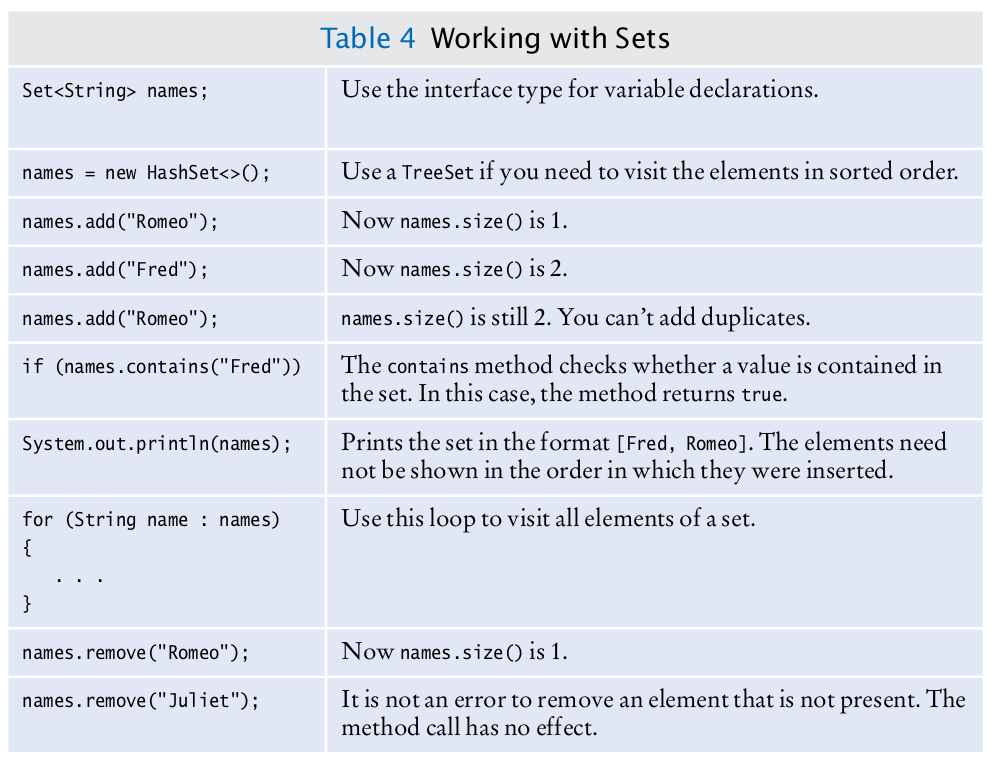
As a rule of thumb, you should choose a TreeSet if you want to visit the set’s elements in sorted order. Otherwise choose a HashSet – as long as the hash function is well chosen, it is a bit more efficient. 
When you construct a HashSet or TreeSet , store the reference in a Set variable. For example, 
```java
Set<String> names = new HashSet<>();
or
Set<String> names = new TreeSet<>();
```
After you construct the collection object, the implementation no longer matters; only the interface is important.

    Set implementations arrange the elements 
    so that they can locate them quickly.
    Sets don’t have duplicates. 
    Adding a duplicate of an element 
    that is already present is ignored.

A set iterator visits the elements in the order in which the set implementation keeps them.

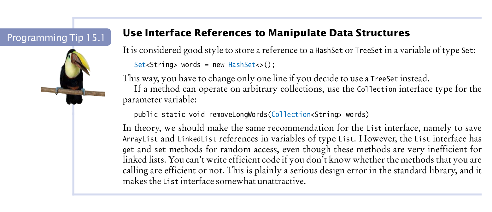

## Map

A map allows you to associate elements from a key set with elements from a value collection. You use a map when you want to look up objects by using a key.

The **HashMap** and **TreeMap** classes both implement the **Map interface**.

After constructing a HashMap or TreeMap, you can store the reference to the map object in a Map reference:
`Map<String, Color> favoriteColors = new HashMap<>();`

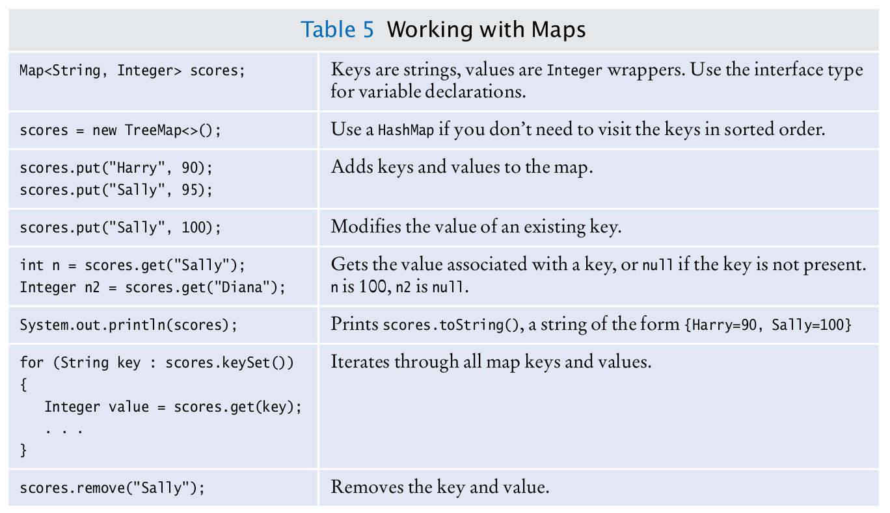

To find all keys and values in a map, iterate through the key set and find the values that correspond to the keys.

```java
Set<String> keySet = m.keySet();
for (String key : keySet)
{
    Color value = m.get(key);
    System.out.println(key + "->" + value);
}
```
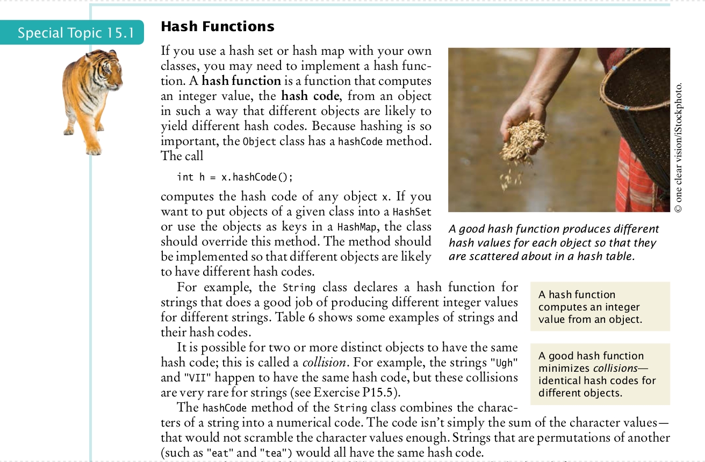

## Stack

A **stack** lets you insert and remove elements only at one end, traditionally called the top of the stack.
New items can be added to the top of the stack. Items are removed from the top of the stack as well. Therefore, they are removed in the order that is opposite from the order in which they have been added, called last-in, first-out or _LIFO_ order.

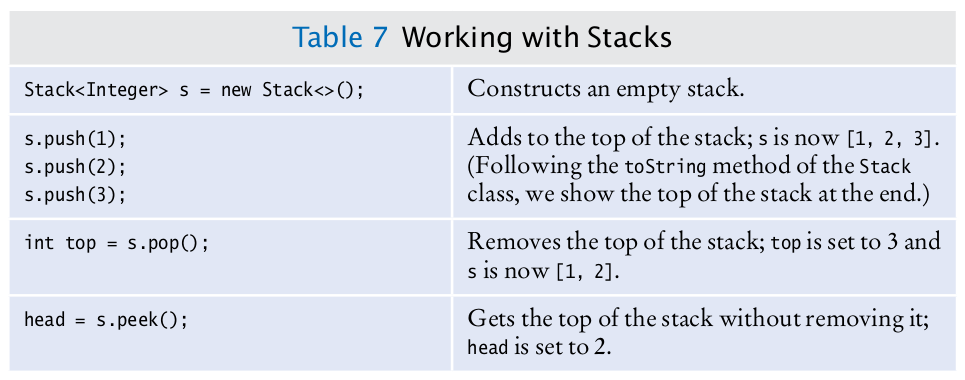

## Queue

A **queue** lets you add items to one end of the queue (the tail) and remove them from the other end of the queue (the head). Queues yield items in a first-in, first-out or _FIFO_ fashion. Items are removed in the same order in which they were added.

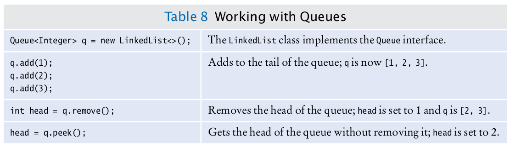

## Priority Queue

A **priority queue** collects elements, each of which has a priority. A typical example of a priority queue is a collection of work requests, some of which may be more urgent than others. Unlike a regular queue, the priority queue does not maintain a first-in, first-out discipline. Instead, ele­ments are retrieved according to their priority. In other words, new items can be inserted in any order. But whenever an item is removed, it is the item with the most urgent priority.

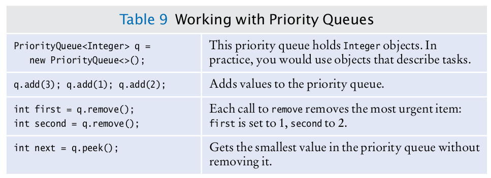


